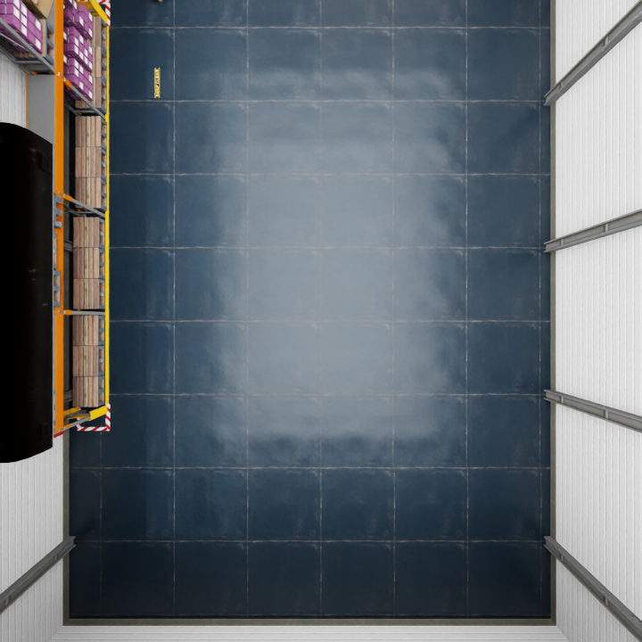
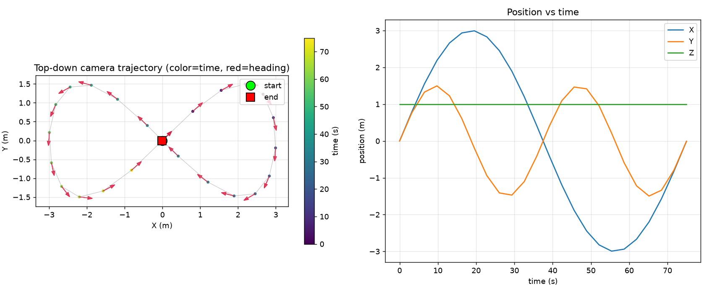
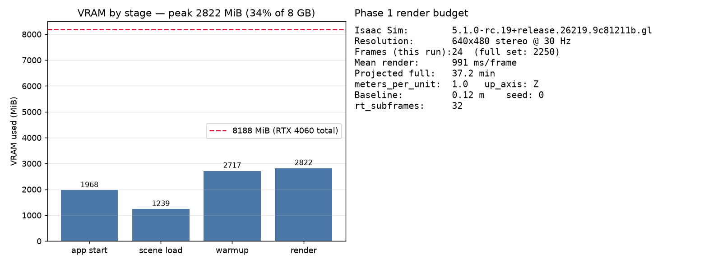
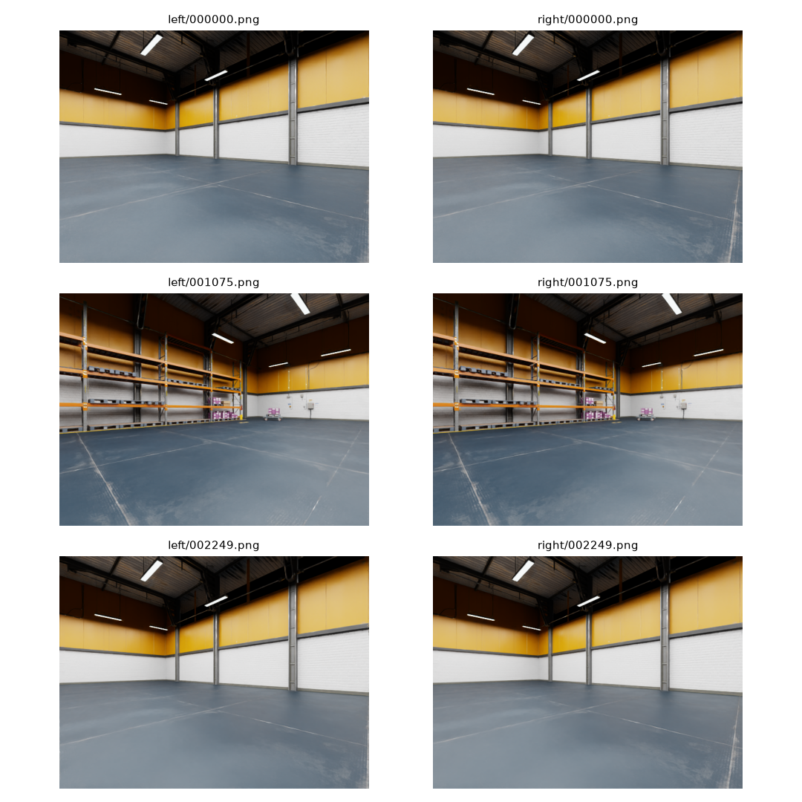
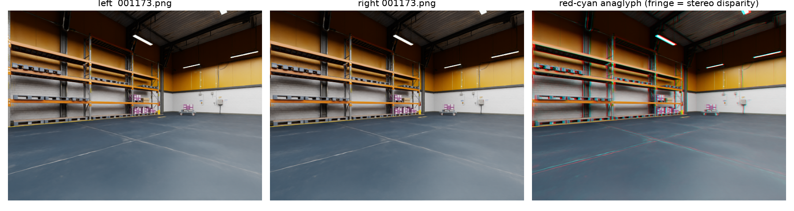

# Visual SLAM Degradation Benchmark — Isaac Sim + Isaac ROS

A reproducible benchmark measuring **how stereo visual-SLAM accuracy degrades
under controlled, physically-parameterized sensor and environment degradations**,
using NVIDIA Isaac Sim for perfect ground truth.

- **Systems under test:** Isaac ROS **cuVSLAM** (stereo) and **ORB-SLAM3** (stereo)
- **Ground truth:** Isaac Sim exact camera poses (TUM format)
- **Metrics (via [`evo`](https://github.com/MichaelGrupp/evo)):** ATE RMSE, RPE
  (translation + rotation), tracking-loss %, relocalization time, per-frame
  latency / FPS, peak VRAM & CPU RAM — 3 seeds each, reported mean ± std
- **Degradations (planned):** motion blur, low light, sensor noise, fog,
  low-texture, dynamic distractors — 3 physical severity levels + clean baseline

---

## ⚠️ Status — this is an in-progress snapshot

| Phase | Description | State |
|---|---|---|
| 0 | Environment audit | ✅ **done** |
| 1 | Scene + trajectory + ground truth | ✅ **pipeline validated** (full 2250-frame render pending reviewer go-ahead) |
| 2 | Degradation pipeline (6 × 3 severities) | ⬜ not started |
| 3 | cuVSLAM runner (clean) | ⬜ not started |
| 4 | ORB-SLAM3 (clean) | ⬜ not started |
| 5 | Full sweep (2 systems × 19 conditions × 3 seeds = 114 runs) | ⬜ not started |
| 6 | Analysis + repo (results table, plots, one-command repro) | ⬜ not started |

> **There are no SLAM accuracy numbers in this repo yet.** Phases 3–6 have not
> been built. This commit covers only the simulation / ground-truth foundation
> and the environment audit. No result is fabricated or estimated — per the
> project's hard rules, every future number will come from a log file on disk.

---

## Hardware / environment (auto-detected, see [`docs/environment.md`](docs/environment.md))

| | |
|---|---|
| GPU | RTX 4060 Laptop, **8 GB VRAM** (hard constraint) — driver 570.195.03 / CUDA 12.8 |
| CPU / RAM | Ryzen 7 7435HS (8C/16T), 15 GiB |
| OS / ROS | Ubuntu 22.04.5, ROS 2 **Humble** |
| Isaac Sim | **5.1.0-rc.19** |
| Isaac ROS / cuVSLAM | **3.2.5** (in `isaac_ros_dev` Docker image, GPU passthrough verified) |
| ORB-SLAM3 | to be built upstream from source (stereo, run offline → TUM) |

Design decisions (storage strategy, ORB-SLAM3 route) are recorded in
[`docs/environment.md` §9](docs/environment.md).

---

## What's built so far (Phase 1)

`scripts/render_scene.py` renders a deterministic stereo fly-through of the
built-in **Simple Warehouse** and exports exact ground-truth poses:

- **Trajectory:** planar figure-eight `x = A·sin(t), y = B·sin(2t)` (A=3 m, B=1.5 m,
  height 1.0 m, 75 s). The self-intersection at the centre is crossed **three
  times with different headings → genuine loop-closure revisits**. The camera
  looks along its direction of motion. Fully deterministic (seeded), reused
  unchanged for every degraded condition so degradation is the only variable.
- **Stereo rig:** 640×480 @ 30 Hz, baseline **0.12 m**, HFoV **90°**, left camera
  is the reference. Intrinsics `fx=fy=320, cx=320, cy=240` (`data/clean/calib.yaml`).
- **Ground truth:** left-camera optical-frame (x-right, y-down, z-forward) pose
  per frame, **TUM format** `timestamp tx ty tz qx qy qz qw` (meters).

### Validation evidence

Measured on a 24-frame validation render spanning the full path: **peak VRAM
2.8 GB**, ~0.99 s/frame → full render ≈ **37 min, ≈ 1.4 GB**. meters_per_unit=1.0
and Z-up were verified from the stage (not assumed).

**Scene** — top-down view of the Simple Warehouse from 7 m, showing the open bay
the figure-eight is flown through, with shelving and stacked pallets along the
west wall providing the texture the stereo matcher keys off.



**Trajectory** — figure-eight top-down with heading arrows, and position vs time.
The centre self-intersection is crossed three times with different headings,
which is what makes the loop-closure revisits genuine rather than a retraced path.



**Render budget** — VRAM by stage against the 8 GB card, plus the render
configuration. Peak 2822 MiB is 34 % of available VRAM, leaving headroom for the
SLAM systems that will run against these frames in later phases.



**Sample stereo pairs** — frames 0, 1075, and 2249, spanning the full path. The
warehouse is well-lit and feature-rich: shelving, floor markings, and structural
columns give a stereo matcher plenty to work with. That matters because the clean
baseline has to be *easy* for degradation to be measurable against it.



**Stereo disparity check** — red-cyan anaglyph of a single pair. Colour fringing
scales with depth (wide on near shelving, narrow on the far wall), confirming the
rig produces correct horizontal disparity rather than two near-identical views.



---

## Reproduce the ground-truth render (Phase 1)

Requires Isaac Sim 5.1 at `/DataDrive/isaac-sim`. Caches are redirected off the
near-full root filesystem onto `/DataDrive`:

```bash
cd /DataDrive/vslam_degradation_benchmark
mkdir -p bench_cache/{xdg,glcache,computecache,mpl}
export XDG_CACHE_HOME=$PWD/bench_cache/xdg
export __GL_SHADER_DISK_CACHE_PATH=$PWD/bench_cache/glcache
export CUDA_CACHE_PATH=$PWD/bench_cache/computecache
export MPLCONFIGDIR=$PWD/bench_cache/mpl
export OMNI_KIT_ACCEPT_EULA=YES

# quick pipeline check (~24 frames + overview, ~2 min):
/DataDrive/isaac-sim/python.sh scripts/render_scene.py --smoke
# full clean dataset (2250 stereo pairs, ~37 min):
/DataDrive/isaac-sim/python.sh scripts/render_scene.py

# regenerate figures from a rendered dataset:
python3 scripts/plot_trajectory.py data/clean
python3 scripts/plot_render_stats.py
```

All tunables live in the single `CONFIG` block at the top of
`scripts/render_scene.py`.

---

## Repository structure

```
vslam_degradation_benchmark/
├── README.md                 # this file
├── progress.md               # timestamped work log (audit trail)
├── docs/
│   ├── environment.md        # Phase 0 environment audit + design decisions
│   └── figures/              # committed visuals for the docs
├── scripts/
│   ├── render_scene.py       # Phase 1: stereo render + TUM ground truth
│   ├── plot_trajectory.py    # trajectory + sample-frame figures
│   └── plot_render_stats.py  # VRAM/timing + stereo anaglyph
├── data/clean/               # calib.yaml + render metadata committed;
│                             #   bulk frames (left/right, GT txt) are gitignored
│                             #   (reproducible from render_scene.py)
└── results/                  # per-run logs & metrics (populated in later phases)
```

Bulk render frames, shader caches, and verbose simulator logs are `.gitignore`d
because they are large and fully reproducible from the scripts above.
